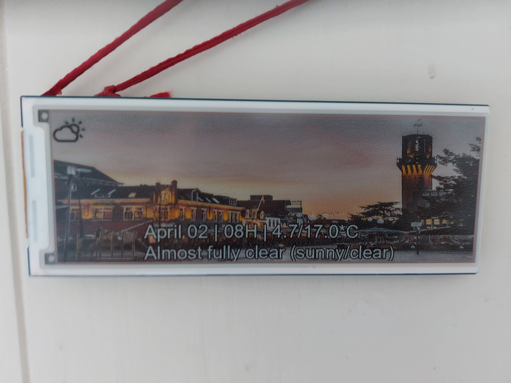

# Smart-Eink
E-ink display that shows a bunch of interesting data.

## Features
  * Ximio waste data (Twente millieu etc.)
  * Buienradar weather data
  * Changing pictures
  * Sleeping for power preservation

## Architecture
The Arduino script just loads the image data in two parts from the webservers, which generates the content on the fly and encodes it in a way the epaper controller can work with.
Must be split in two parts since the NodeMCU does not have enough RAM to hold the full resolution picture.
Some caching is used to not hammer the buienradar api etc. too much.